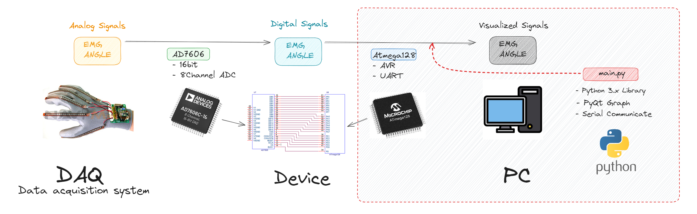

## 🤚EMG and Angle Data Visualization

<p align="center">
	
</p>

---

- This repository contains a program for visualizing EMG (Electromyography) and angle data using PyQtGraph. 
- The program allows users to collect and visualize real-time data from multiple channels. 
- The main method collects and saves the data, while the timing method controls the timing of data collection using keyboard inputs.
- The collected data is stored as numpy arrays in separate files.
- The naming convention for the files is {Number}_{index}.npy, where {Number} is the input number provided by the user, and {index} is the index of the data set.

---
<p align="center">
	
</p>

---

This program is designed to visualize the data received by a PC through the UART feature of ATmega128. Additionaly, the data is in the form of digital signals, which have been converted from analog using AD7606.

---


## 👉Requirements
```
Python 3.x
PyQtGraph
pyqtgraph.Qt
threading
sys
serial
numpy
struct
keyboard
```

## ✌️Usage
1. Clone the repository:
```
git clone https://github.com/your-username/emg-angle-data-visualization.git
```
2. Install the required dependencies:
```
pip install pyqtgraph
pip install pyserial
pip install keyboard
```
3. Connect the EMG and angle sensors to the appropriate serial port
> modify port variable if needed
```
self.port = 'COM7'
self.baud = 2000000
```
4. In this program, specific packets and numbers are used to indicate the start and end of data transmission
> modify start and end packet
```
self.start = 0x0b
self.end = 0x0c
```
5. Run the program:
```
python main.py
```

## 👍Authors
sbeen1840

## 👌License
This project is licensed under the MIT License - see the LICENSE file for details.
